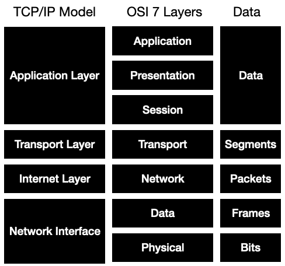
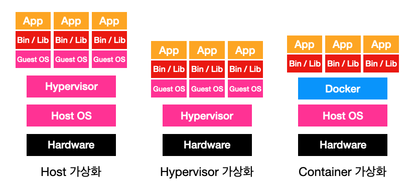

    
    </a>

1.클라우드 개념
===============

**
 AWS 공인 클라우드 전문가(CLF-C01)
**

### 목표

1.1 AWS 클라우드 및 가치 제안 정의  
1.2 AWS 클라우드의 경제적 측면 파악  
1.3 클라우드 아키텍처의 다양한 설계 원리 나열

### 클라우드 컴퓨팅(Cloud Computing)

-	인터넷 통신 서비스를 활용한 컴퓨팅 서비스 종류의 하나로 개인용 컴퓨터가 아닌, 인터넷을 통해 필요한 만큼 원할때마다 IT리소스를 사용한만큼만 (On-promise,Iaas,Paas,Saas) 지불하는 대용량 서비스를 말한다.

### 클라우드 네트워크

  

### 클라우드 핵심기술

**가상화 기술(Virtualization)**  
 가상화는 물리적인 하드웨어 장치를 논리적인 객체로 추상화하는 것을 의미. 하나의 장치를 여러개로 나눠 작동시키거나 여러개의 장치를 묶어 마치 하나의 장치인 것처럼 사용자에게 공유 자원으로 서비스한다.  

-	**호스트 가상화(Host Virtualization)**  
	하드웨어 위에 기본이 되는 호스트 운영체제를 설치하고, 호스트 운영체제에 가상화 소프트웨어를 설치하여 운영체제를 작동시키는 가상화 서비스로 가상화 소프트웨어를 사용하여 손쉽게 가상화 환경을 구축할 수 있기때문에 개발 환경 구축 등에 많이 사용된다. 하지만 호스트 운영체제 위에 게스트 운영체제를 작동시켜야 하기 때문에 CPU 메모리 사용이 증가하는 오버헤드가 발생한다.  
-	**하이퍼바이저 가상화(HyperVisor Virtualization)**  
	하드웨어 가상화를 전담하는 소프트웨어인 하이퍼바이저를 배치해 하드웨어와 가상 환경을 제어한다. 호스트가 없는 하드웨어를 직접 제어하기 때문에 컴퓨팅 자원을 효율적으로 사용할 수 있다. 하지만 다른 운영체제가 작동하기 때문에 가상 환경을 사용하기 위한 오버헤드가 발생한다.  
-	**컨테이너 가상화(Container Viertualization)**  
	운영체제에 논리적인 영역(컨테이너)을 만들고, 애플리케이션을 작동하는 데 필요한 라이브러리와 애플리케이션 등을 컨테이너 안에 넣고 미차 개별 서버처럼 사용할 수 있게 하는 기술이다.  

**클러스터링**

**서버리스**  
**로드밸런싱**  
**스케일 업(Scale-Up), 스케일 아웃(Scale-Out)**  
**오토스케일(auto scale)**

### 클라우드 시장 점유율

**점유율**  
- AWS > Microsoft Azure > Google Cloud > Alibaba Cloud > Others (2020.2.20 기사기준)

**매출 비중**  
- SaaS > Iaas > PaaS >= BPaas  
(Service 가상화 비용이 대부분 매출이 제일 좋고 Paas는 서비스 유형상 포지션이 조금 애매해서 매출비중이 작은것으로 보인다.)

**국내 서비스별 점유율**  
- IaaS : AWS > KT > LG > IBM > Others  
- Paas : MS > AWS > Oracle > Saleforce.com > Others  
- SaaS : SAP > Microsoft > Duzon Bizon > Veeva Systems > Others

### 클라우드 컴퓨팅 서비스 모델

-	**Iaas(Infrastructure-as-a-Services)** : 물리적 서버, 네트워크, 스토리지를 가상화하여 다수의 고객을 대상으로 유연하게 제공하는 **Hardware 가상인프라 서비스** (예. AWS, GCP, AZURE)  
-	**PaaS(Platform-as-a-Services)** : Web기반의 서비스 또는 애플리케이션 등의 개발 및 실행을 위한 표준 **플랫폼 환경을 서비스형태로 제공** 한다. (예. Google App Engine)  
-	**SaaS(Software-as-a-Services)** : 응용프로그램을 인터넷 및 웹 브라우저를 통해 **소프트웨어 가상화** 로 제공하는 서비스(예. Google's gmail, MSOffice 365, airdrop, evernote)

### 클라우드 유형

-	**Public Cloud** : 특정 기업이나 사용자를 위한 서비스가 아닌 인터넷이 접속가능한 모든 사용자를 위한 클라우드 서비스 유형이다. 데이터나 기능, 서버 같은 자원은 각 서비스에서 사용자 별로 권한 관리가 되거나 겨리되어, 서비스 사용자 간에는 전혀 간섭이 없다. (오피스, 메일, 개인 일정관리))
-	**Private Cloud** : 제한된 네트워크 상에서 특정 기업 내부에 저장된다. 때문에 기업이 자원의 제어권을 갖고있으며 보안이 매우 뛰어나다. (ERP등 기업의 핵심 서비스)
-	**Hybrid Cloud** : **Public Cloud + Private Cloud** 를 의미하며. 퍼블릭 클라우드의 유연성, 경제성, 신속성과 물리 서버의 보안성, 안정성 등을 함께 구성할 수 있는 서비스 유형을 의미한다.  

### AWS 클라우드

-	AWS를 통해 서버, 데이터베이스, 스토리지 및 상위 애플리케이션 구성요소를 몇 초 이내에 엑세스 할 수 있다.
-	임시 또는 일회용 리소스로 취급할 수 있어 고정적이고 유한한 IT인프라를 경직성과 제약으로부터 자유로울 수 있다.  

### AWS 클라우드 특성

#### 민첩성 (Agility)

-	**속도(Speed)** : 막대한 투자와 비용이 필요없이 전세계 네트워크에 빠르게 서비스가 가능  
-	**실험(Experimentation)** : 클라우드 환경을 통해 실험을 자주 할 수 있으며 빈번한 실험을 통해 새로운 구성과 탐색이 가능하다.  
-	**혁신의 문화 (Culture of innovation)**  
-	**CloudFormation** 을 통해 일관적이고 템플릿화된 개발 환경 구축이 가능하다.  
	*CloudFormation - AWS에서 제공하는 템플릿이나 개발자 혹은 시스템 관리자가 작성한 템플릿을 이용해 AWS 리소스들을 쉽게 생성하고 관리하는 방법을 제공한다.*

#### 내결함성

-	시스템 구성 요소에 장애가 발생하더라도 시스템이 작동 가능 상태를 유지하는 능력(애플리케이션 구성 요소의 기본적인 중복성)

#### 고가용성

-	사용자 개입 없이 시스템이 항상 자동으로 액세스 가능하며 가동 중지가 최소화되도록 하는 능력

### 탄력성

-	간편하게 컴퓨팅 리소스의 규모를 확장하거나 축소할 수 있는 능력

Written by <a href="https://github.com/LunightLab">@Lunight</a><small></small>

