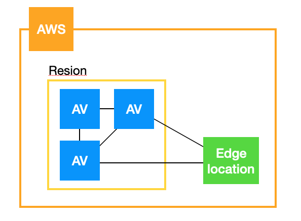

<div align=right>
    <a href="https://github.com/LunightLab">
        </a>
    </a>
    <a href="https://github.com/LunightLab/LuLabTemplate">
        </a>
    </a>
</div>

2.핵심서비스
============

**<div align=right> AWS 공인 클라우드 전문가(CLF-C01)</div>**

### 목표

주요 서비스에 대한 이해

---

### AWS 글로벌 인프라

<p align="center"></p>  

**리전**  
- 2개 이상의 독립적인 가용 영역(AZ)을 호스팅하는 개별 지리적 영역이다.  
- 하나의 리전의 리소스는 다른 리전으로 자동 복제되지 않음(수동으로 복제해야함.)  
- 인스턴스를 시작할 때 동일한 리전에 있는 AMI(Amazon Machine Images)를 선택해야 한다.  
 (다른 리전에 있는 AMI의 경우 복제하여 사용해야한다.)

**가용영역(AZ)**  
- 특정 리전 내에 존재하는 데이터 센터의 모음  
- 같은 리전 내에 각 가용 영역들은 서로 격리되어 있지만 지연 시간이 짧은 링크로 연결되어 있다.  
- 물리적으로 구분된 독립적 인프라  
- 물리적, 논리적으로 분리  
- 별도의 무정전 전원 공급 장치(UPS), 현장 예비 발전기, 냉각 장비, 네트워킹 및 연결 수단으로 구성  
- 독립적인 전력 회사의 서로 다른 전력망을 통해 전력 공급  
- 여러 티어1 전송 서비스 공급자를 통해 연결  
- 다중 가용영역에 걸쳐 프로비저닝할 것을 권장한다.  
- **리전코드** + **식별문자** 의 조합으로 표시된다(예.us-east-1a) A계정의 us-east-1a와 B계정의 us-ease-1a는 가용영역과 위치가 다르다.

**엣지 로케이션(Edge Location)**  
- 사용자의 지리적으로 근접한 AWS 리전의 확장 영역이다.(사용자에게 빠른시간에 통신을 제공할 수 있다.)  
- CloudFront라고 하는 CDN 호스팅  
- 여러 엣지 로케이션과 리전을 구성된 글로벌 네트워크를 활용하면 빠른 컨텐츠 전송이 가능하다.  
- 리전 및 가용 영역들과 미슷하게 인구 밀도가 높은 지역에 위치한다.

```
1. 웹 브라우저를 통해 이미지 요청(User -> 브라우저)
2. IP주소요청 (브라우저 -> DNS)
3. 가장 최적화된 엣지 로케이션으로 라우팅 (DNS -> User)
4. 엣지 로케이션으로 데이터 요청 (User -> Edge location)
5. 엣지 로케이션에서 데이터 비교 (edge location)
6. (틀린 경우) 가용영역으로 데이터 요청 (edge location -> Available zone)
7. AZ에서 데이터 전달 (Available zone -> edge location)
8. 엣지로케이션에서 사용자에게 데이터 전달(edge location -> User)
```

---

### VPC(Virtual Private Cloud)

**기본정보**  
- AWS 네트워킹 서비스  
- 온프레미스 네트워크와 동일한 여러가지 개념 및 구성을 클라우드 내 프라이빗 네트워크 생성이 가능하다.  
- 제어, 보안 및 유용성을 저해하지 않고도 네트워크 설정의 복잡성이 상당 부분 추상화되어 있다.  
- IP 주소공간, 서브넷, 라우팅 테이블과 같은 일반 네트워킹 구성 항목 정의가 가능.  
- EC2, RDS 등 여러 버시브와 통합

**기능**  
- 리전 및 가용 영역의 AWS 글로벌 인프라를 기반으로 한다.  
- 리전 내에 있으며 여러 가용 영역에 걸쳐 확장이 가능하다.  
- 다중 VPC 생성이 가능  
- 여러 서브넷에 의해 분할되는 하나의 IP 주소 공간의 정의가 가능하다.  
- 서브넷과 인터넷 사이의 트레픽 제어를 위해 서브넷 라우팅 테이블 구성이 가능  
- VPC 내 모든 서브넷은 서로 통신이 가능하다.

**참고**  
[https://aws.amazon.com/ko/about-aws/global-infrastructure/](https://aws.amazon.com/ko/about-aws/global-infrastructure/)

---

### AWS Direct Connect

-	온브레미스에서 AWS로 전용 네트워크를 연결 할 수 있는 서비스  

---

### 보안그룹

**기본**  
- 내장 방화벽과 같은 개념으로 인스턴스에 대한 접근을 제어  
- 보안 그룹 규칙을 구성해 트래픽을 Allow/Deny할지를 결정  
- 해당 인스턴스를 프라이빗 또는 퍼블릭 상태로 유지하거나 혹는 Hybrid 상태로 유지할 수 있는 다양한 구성이 가능  
- 인바운드, 아웃바운드, 트래픽 유형, 프로토콜, 포트 및 Source / Destination Packet 제어 가능  
- 사용 중인 인스턴스에 필요한 트래픽이 무엇인지를 파악하여 해당 트래픽만 허용할 것을 권장한다.(White list 정책)

---

### 라이트세일(Amazon Lightsail)

**기본**  
- 가상 프라이빗 서버를 시작하고 관리할 때 사용할 수 있는 가장 간단한 방법으로 설계  
- 프로젝트 착수에 필요한 모든 것이 포함되어 있다. - 가상머신  
 - SSD  
 - 데이터 전송  
 - DNS 관리  
 - 고정 IP 주소

---

### AWS Batch

**기본**  
- 수많은 배치 컴퓨팅 작업을 효율적으로 관리가 가능하도록 하는 서비스  
- 제출된 배치 작업의 볼륨 및 특정 리소스 요구사항에 따라 최적의 수량 및 유형의 컴퓨팅 리소스를 동적으로 프로비저닝한다.

---

### 람다(AWS Lamda)

**기본**  
- 서버를 프로비저닝하거나 관리할 필요 없이 코드를 실행할 수 있는 컴퓨팅 서비스  
- 필요할 때만 코드를 실행  
- 초당 수천 건의 요청으로 자동 확장  
- 코드가 실행되지 않는 시간에 대해서는 비용이 발생하지 않는다.  
- 모든 애플리케이션, 백엔드 서비스에 대한 코드 실행 가능  
- 고가용성 컴퓨팅 인프라에서 코드 실행  
- 서버 및 OS 유지관리, 용량 프로비저닝, Auto Scaling, 코드 모니터링, 로깅 등 관리 기능제공  
- 다양한 프로그래밍 언어 지원  
- AWS CodePipeline, AWS CodeDeploy를 통해 자동 배포가 가능하다.  
- MSA(Micro Service Architect) 구축

**옵션**  
- 최대 512MB 디스크 공간  
- Memory 128MB ~ 3,008MB  
- 최대 15분까지만 실행  
- 최대 6MB의 요청 및 응답  
- 최대 128KB의 이벤트 요청 본문

**사용예시** - 백업 자동화  
- S3에 업로드된 객체 처리  
- 이벤트 중심의 로그 분석  
- 이벤트 중신의 변환  
- IoT  
- 서버리스 웹사이트 운영  
- Amazon Kinesis를 통한 실시간 스트리밍 데이터 처리  
 - 애플리케이션 활동 추적  
 - 트랜잭션 처리  
 - 클릭 스트림 분석  
 - 생성 로그 필터링  
 - 소셜 미디어 인덱싱 분석  
 - 디바이스 데이터 원격 측정 및 모니터링

---

<br><div align="center">

<sub><sup>Written by <a href="https://github.com/LunightLab">@Lunight</a></sup></sub><small></small>

</div>
