

    
    </a>
    
    </a>

AWS-Cloud Practitioner Essentials(Second-Edition)
=================================================

**
AWS의 통합형 서비스
**

### Application Load Balancer

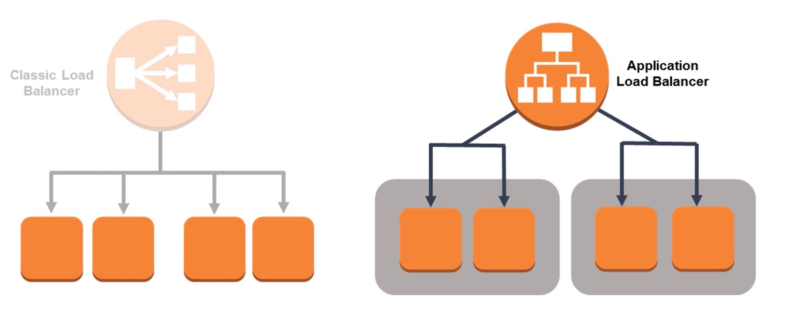
  

**ALB**  
- ALB(Application Load Balancer)는 Elastic Load Balancing 서비스의 일부로 도입된 두번째 유형으 로드밸런서이다.  
- Classic Load Balancer가 제공하는 대부분의 기능을 제공하고 추가로 중요한 기능과 개선사항이 추가되었다.

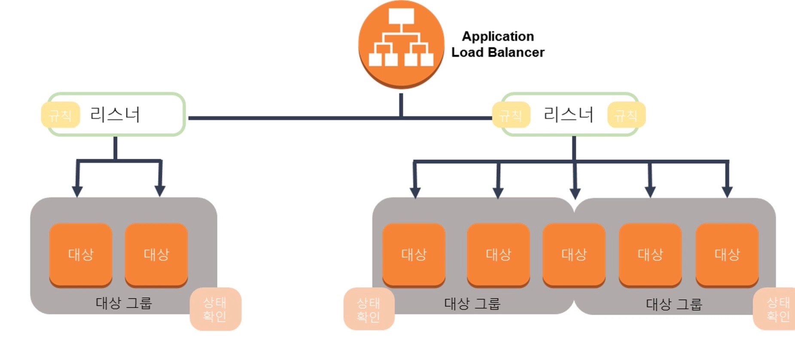
   

**향상된 기능**  
- 지원하는 프로토콜 : HTTP, HTTPS, HTTP/2, WebSockets  
- CloudWatch 지표 : 추가적인 로드밸런싱 지표 및 대상 그룹 지표 차원  
- Access Log : WebSocket 연결의 세부정보를 볼 수 있는 기능  
- Status check : 더욱 세분화된 수준에서 대상 및 애플리케이션 상태에 대한 통찰력

**기타 기능**  
- 경로 및 호스트 기반 라우팅 : 경로 기반으로 요청을 각기 다른 대상 그룹으로 전달하는 규칙을 제공. 호스트 기반은 호스트 이름에 따라 요청을 각 다른 대상 그룹으로 전달하는 규칙을 정의하는데 사용할 수 있다.  
- 네이티브 IPV6 지원  
- 삭제 보호 및 요청 추적 : 요청 추적은 클라이언트에서 대상으로 http요청을 추적하는데 사용할 수 있다.  
- 동적 포트 : AmazonECS는 Application Load Balancer와 통합되어 일정이 예약된 컨테이너에서 사용하는 동적 포트를 노출한다.  
- AWS WAF

**주요용어**  
- 리스너 : 리스너는 구성한 프로토콜 및 포트를 사용하여 연결 요청을 확인하는 프로세스이다. 리스너에 대해 정의한 규칙에 따라 로드 밸런서가 하나 이상의 대상 그룹에 있는 목적지로 라우팅 하는 방법이 결정된다.  
- 대상 : 설정된 리스너 규칙에 때른 트래픽 목적지이다.  
- 대상 그룹 : 각 대상 그룹은 지정된 프로토콜과 포트 번호를 사용하여 하나 이상의 등록된 대상으로 요청을 라우팅한다. 상태 확인은 대상 그룹별로 구성될 수 있다.

### Auto Scaling

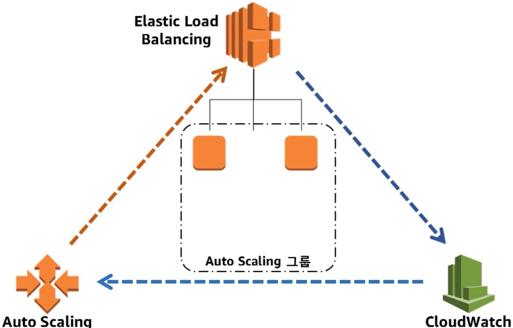
   

-	Auto Scling을 사용하면 애플리케이션 로드를 처리할 수 있는 적절한 수의 EC2 인스턴스를 유지하여 리소스를 최소화할 수 있다.  
-	워크로드 요구 사항을 충족하기 위해 필요한 시점에 EC2 인스턴스 수를 추측할 필요가 없다.  
-	Auto Scling을 사용하면 지정한 조건에 따라 EC2 인스턴스를 추가하거나 제거할 수 있다.  
-	Auto Scling은 성능 요구 사항이 변화하는 환경에서 강력하다. 이를 통해 성능을 유지하고 비용을 최소화하여 운영할 수 있다.  

**질의**

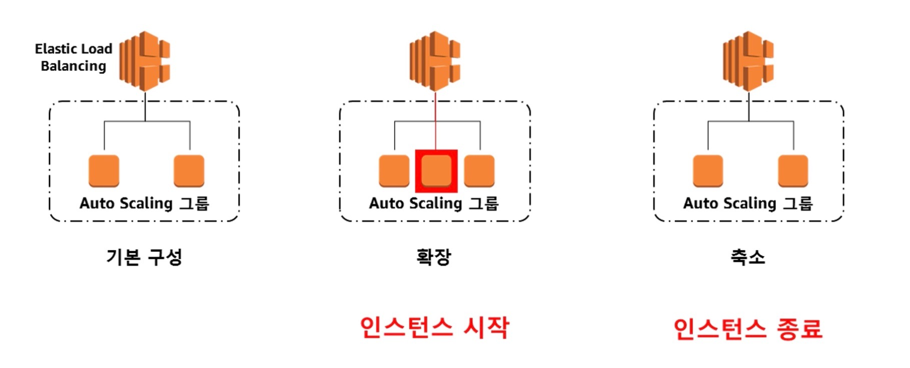
  

Q. 내 워크로드에 변화하는 성능 요구사항을 충족하기 위해 충분한 EC2 리소스가 있는지 어떻게 확인 할 수 있는가?  
A. 확장성  
Q. 온디맨드로 EC2 리소스 프로비저닝을 자동화할 수 있는가?  
A. 자동화

**WatchCloud**

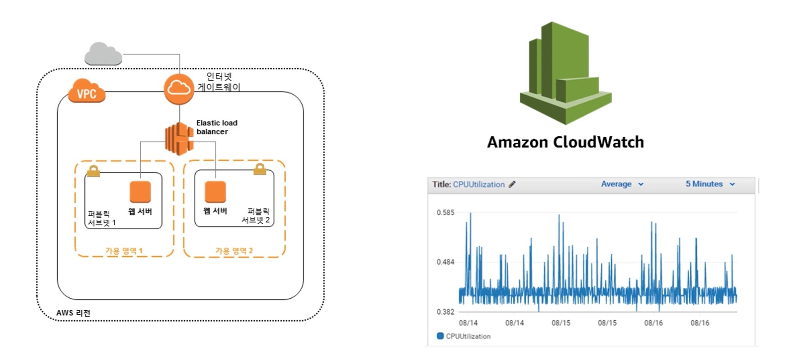
   

EC2 인스턴스에서 애플리케이션을 실행할 때 Amazon CloudWatch를 이용하여 워크로드 성능을 모니터링하는것이 중요하다. CloudWatch 자체에서 인스턴스를 추가하거나 제거하지 않기 때문에 **AutoScaling**이 필요함

**자동으로 확장하기 위한 AutoScaling의 필수 3가지 구성요소**  

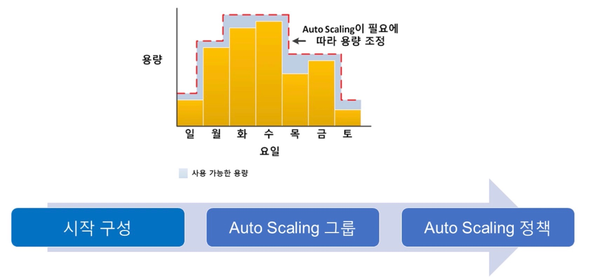

-	시작 구성 생성(What?)

	-	사용할 AMI(Amazon Machine Image)  
	-	인스턴스에 적용할 인스턴스 유형  
	-	보안 그룹  
	-	역할  

-	AutoScling 그룹 생성(Where?)

	-	로드 밸런서와 상호 작용할 인스턴스를 배포할 VPC와 서브넷 정의  
	-	그룹에 대한 경계를 지정(최소-최대 인스턴스 및 용량)  

-	하나 이상의 Auto Scling 정책 정의(When?)

	-	예약  
	-	확장 또는 축소 시간을 정의  
	-	온디맨드  
	-	조건 기반 정책은 Auto Scling을 동적으로 만들어 변화하는 요구사항을 충족할 수 있다.  

### Amazon Route 53

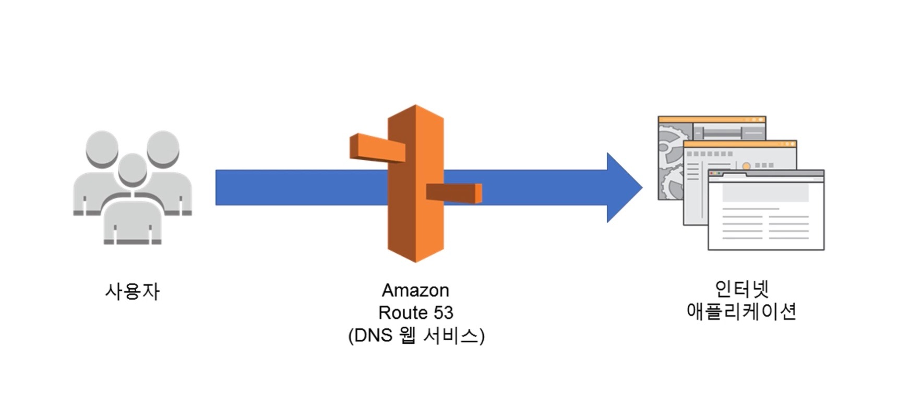
  

-	인터넷 애플리케이션으로 라우팅 할 수 있는 안정적이고 확장 가능한 방법을 제공하기 위해 설계된 웹서비스인 DNS(Domain Name System)  
-	DNS 이름을 쉽게 등록할 수 있으며 관리형 서비스를 제공하고 사용자를 콘텐츠로 쉽게 유도할 수 있는 글로벌 고가용성 DNS 서비스이다.  
-	www.example.com과 같은 이름을 컴퓨터가 서로 연결하는데 IP주소로 변환하여 클라이언트에 제공한다(사용자와 엔드포인트를 함께 연결 가능)  
-	엔드 포인트는 **Amazon EC2 인스턴스, Elastic Load Balancer, Amazon CloudFront 배포, 모든 인터넷 엔드포인트, 온프레미스 데이터 센터에 있는 리소스까지 포함** 할 수있다.  
-	트래픽 경로를 지정하는 여러 방법을 제공하므로 애플리케이션 및 사용자의 지연 시간을 최적화할 수 있다.  
-	AWS 서비스이기 때문에 많은 AWS 클라우드 서비스와 통합하여 사용이 가능  

**작동원리**  

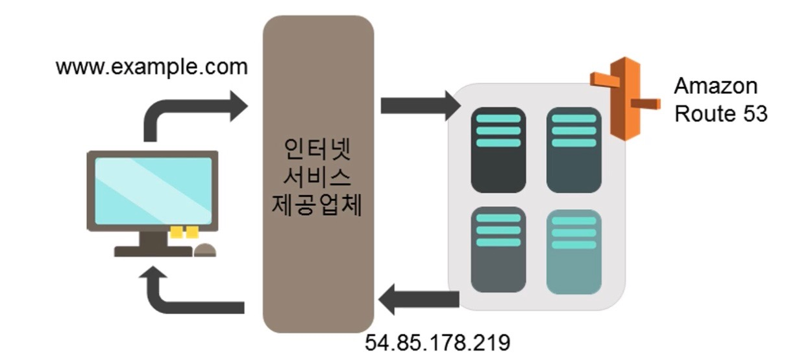

1.	사용자가 웹브라우저를 열고 도메인 입력 ex)www.example.com  
2.	쿼리는 인터넷 서비스 공급자의 DNS 서버로 라우팅 됨  
3.	DNS가 Amazon Route 53에서 처리되면서 인터넷 서비스 공급자의 DNS 해석기가 Amazon Route 53에서 호스팅 및 관리하는 도메인 이름 서버로 요청을 전달한다.  
4.	Route 53 서버는 www.example.com과 같은 값을 수집해 ip주소를 인터넷 서비스 제공업체에 반환한다  
5.	사용자는 지정된 콘텐츠를 부여받는다  

**Route53 기능**  

### Amazon Relational Database Services(RDS)

**관계형 데이터베이스의 문제점**  
- 서버 유지 관리 및 에너지 소비(foot print)  
- 소프트웨어 설치 및 패치  
- 데이터베이스 백업 및 고가용성  
- 확장성 제한  
- 데이터 보안  
- OS 설치 및 패치

**Amazon RDS**  

-	Amazon RDS는 클라우드에서 관계형 데이터베이스를 설정하고 운영하는 관리형 서비스이다  
-	Amazon RDS는 비용 효율적이고 크기 조정 가능한 용량을 제공하고, 시간 소모적인 관리 작업을 자동화할 수 있다.  
-	Amazon RDS는 애플리케이션에만 집중할 수 있도록 하기 때문에 성능, 고가용성, 보안 및 호환성을 제공할 수 있다. (데이터와 애플리케이션 최적화에 집중할 수 있다.)  

**관리 대상**  
|사용자의 관리대상|AWS의 관리대상|  
|:---:|:----|  
|- 애플리케이션 최적화|- OS 설치 및 패치 - 데이터베이스 소프트웨어 설치 및 패치 - 데이터베이스 백업 - 고가용성 - 규모조정 - 전력 및 렉과 스택 - 서버유지관리

**Amazon RDS DB 인스턴스**  

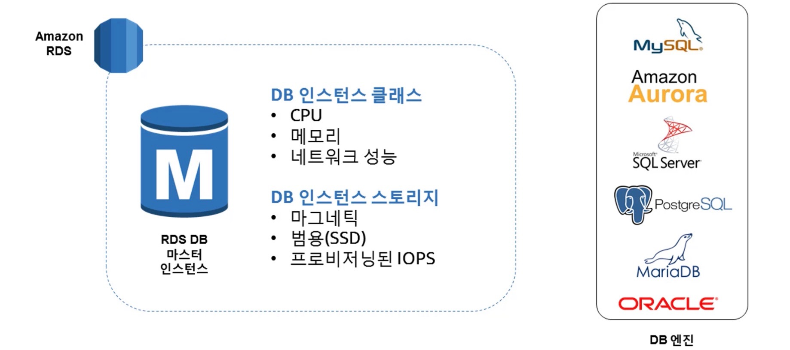

**Virtual Private Cloud 내 Amazon RDS**  

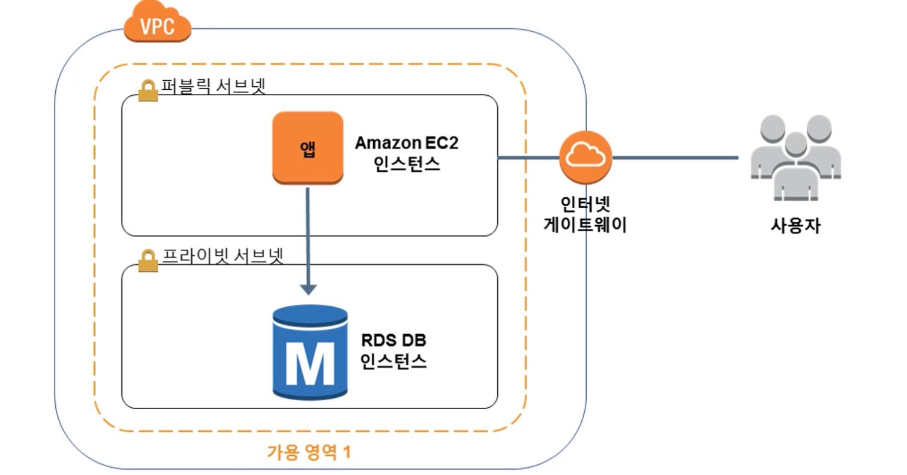

**다중 AZ를 통한 고가용성**  

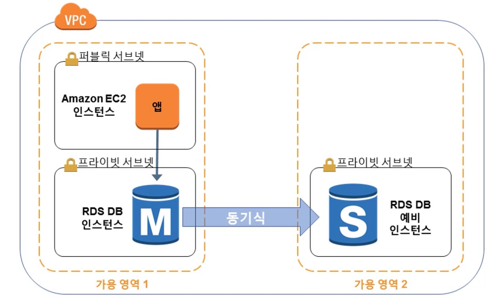
  

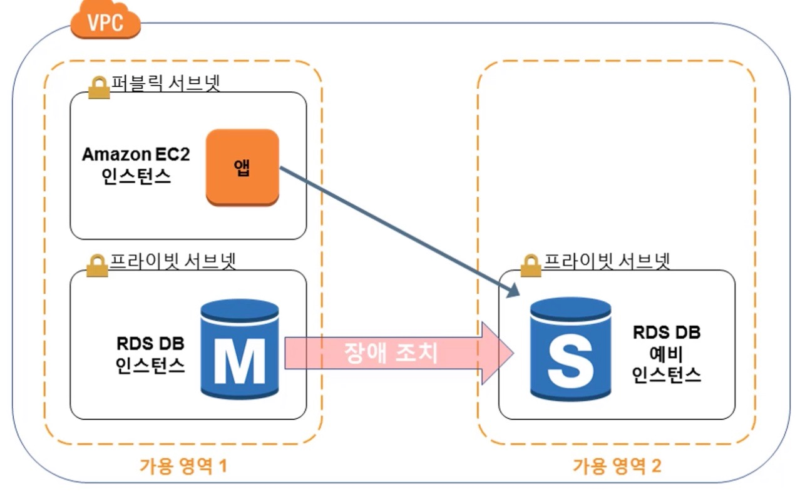

**Amazon RDS 읽기 전용 복제본**  

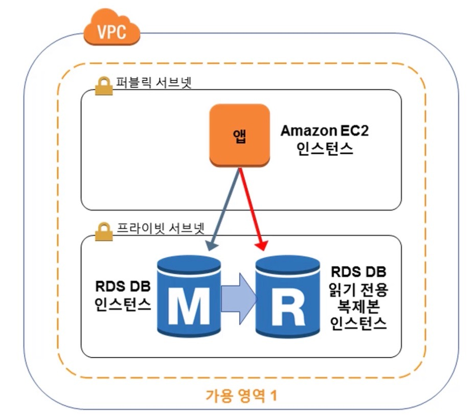

-	비동기식 복제 방법을 사용한다  
-	마스터 DB인스턴스의 읽기 쿼리를 오프로딩  
-	Read Only 데이터베이스 워크로드에 이상적이다  
-	필요한 경우 읽기 전용 복제본을 이용하여 마스터로 승격이 가능하다  

**사용사례**

|웹 및 모바일 Application|전자상거래 Application|모바일 및 온라인게임|  
|:---|:---|:---|  
|- 높은처리량 - 대규모 스토리지 - 고가용성|- 저렴한 데이터베이스 - 데이터 보안 - 완전관리형 솔루션|- 신속한 용량 확장 - AutoScling  - DB 모니터링|

### AWS Lamda

준비중...

### AWS Elastic Beantalk

준비중...

### Amazon Simple Notification Service(SNS)

준비중...

### Amazon CloutWatch

준비중...

### Amazon CloudFront

준비중...

### AWS CloutFormation

준비중...

Written by <a href="https://github.com/LunightLab">@Lunight</a><small></small>

